<div align="center">


# TwinGaze

**Find hidden cameras with the phone in your pocket.**
On the phone, offline, in English, हिंदी and తెలుగు.

[](https://github.com/SOURABREDDY394/twingaze/raw/main/dist/TwinGaze.apk)


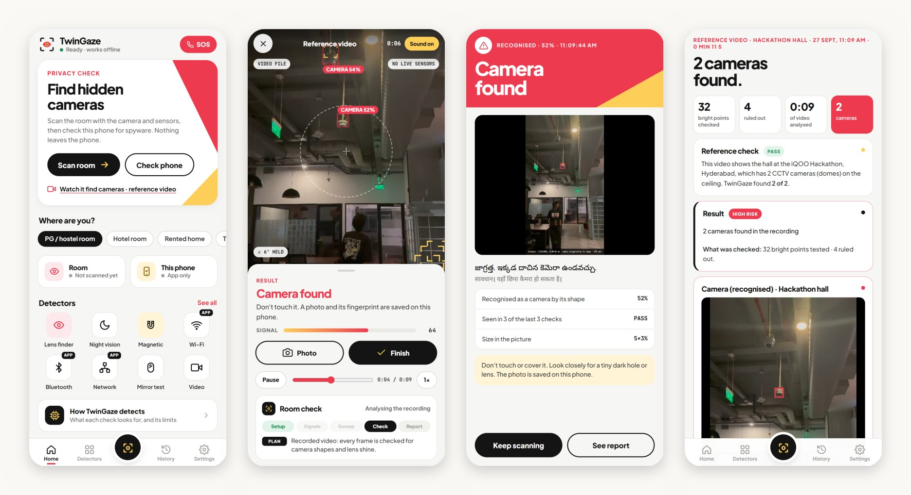

</div>

---

## Contents

- [The problem](#the-problem)
- [What TwinGaze does](#what-twingaze-does)
- [Screenshots](#screenshots)
- [How to use it, tab by tab](#how-to-use-it-tab-by-tab)
- [How it works](#how-it-works)
- [AI models](#ai-models)
- [Architecture and tech stack](#architecture-and-tech-stack)
- [Install the app](#install-the-app)
- [Build from source](#build-from-source)
- [Project structure](#project-structure)
- [Privacy](#privacy)
- [Limits](#limits)
- [Team and credits](#team-and-credits)

---

## The problem

Ananya is 21. She has moved from Warangal to Hyderabad for her first job and rents a room in a women's PG. Her room has a wall clock, a phone charger and a smoke detector, and any of them could hide a camera or an audio recorder. These devices cost a few hundred rupees online and fit inside a charger.

This is not only a story: cameras keep being found in PG hostels, hotel rooms, trial rooms and washrooms across India. And a study from NUS (LAPD, ACM SenSys 2021) found that people searching by eye find fewer than half of hidden cameras.

Today the tools are **scattered**: one app reads the magnetic field, another looks for infrared lights, a third scans Wi-Fi, a fourth finds trackers, an antivirus looks for spyware, and yet another app does SOS or a fake call. Many camera-finder apps only read the magnetic sensor, so they beep near every charger and people stop trusting them. None of them guides you, none keeps evidence, and most speak only English.

**TwinGaze puts all of it in one app** that runs on the phone, works offline, makes the signals confirm each other, guides you by voice in your language, and keeps evidence you can use.

---

## What TwinGaze does

### Find cameras and hidden devices
| Check | What it finds | How |
|---|---|---|
| **Camera shape (AI)** | CCTV, dome, bullet cameras; phones used as cameras; laptop webcams | A YOLO11s model trained for TwinGaze, running on the phone |
| **Lens finder** | Pinhole cameras hidden inside objects | The flash bounces straight back off a lens; every bright spot goes through a chain of tests |
| **Magnetic** | Powered electronics up close: cameras, audio recorders, trackers | The magnetometer; beeps faster as you get closer |
| **Night vision** | Night-vision cameras in a dark room | Their infrared LEDs show up as purple dots |
| **Mirror test** | Two-way mirrors | Fingernail, flashlight and knock tests, guided step by step |
| **Recorded video** | Cameras in a video of a room | The same checks, frame by frame; a video of the hackathon hall is built in as a reference |

### Radio and network
| Check | What it finds |
|---|---|
| **Wi-Fi scan** | Camera hotspots (HD-xxxx, IPCAM, V380…) and camera makers' radios nearby |
| **Bluetooth scan** | AirTag, Tile and SmartTag trackers, Bluetooth cameras |
| **Network scan** | Cameras on the Wi-Fi you joined (RTSP, ONVIF, DVR ports) |
| **Network check** | Whether the Wi-Fi is private: open/WEP networks, fake copies ("evil twins"), proxies, who can see your browsing |

### Your own phone
| Check | What it finds |
|---|---|
| **Phone check** | 158 known stalkerware and monitoring apps (by package name or signing certificate), hidden apps, apps abusing accessibility or device admin, weak security settings; one tap opens Android's uninstall dialog |
| **App trackers** | About 60 tracking and advertising SDKs built into your apps |
| **Camera and mic** | Which apps can use them, whether one is in use right now, and an alert if they are used while the screen is off |

### Personal safety
| Feature | What it does |
|---|---|
| **SOS** | Press the power button 3 times (even when locked), shake the phone hard, or use the Quick Settings tile: a 5-second countdown, then an SMS with your location to your trusted contact, and a "Call 112" button |
| **Shake inside the app** | Three hard shakes anywhere in TwinGaze open the SOS sheet |
| **Fake call** | Your phone rings with its own ringtone and a real-looking call screen, now or after 10 s, 30 s or 1 minute, even with the phone locked, so you have a reason to leave |
| **Siren** | A loud alarm with the flash blinking |
| **Share my location** | A map link plus what TwinGaze found, to someone you trust |
| **Helplines** | 112 emergency, 181 women helpline, 1930 cyber crime |
| **Protection outside the app** | Keeps SOS, the fake call and privacy alerts working when TwinGaze is closed |

### Evidence and report
- Every find is saved as a **time-stamped photo with a SHA-256 fingerprint**, so it can be shown that the file was not edited.
- The **report** gives a result (high risk, check again, low risk) with the reasons, the photos, and a **complaint ready to send** in English or Hindi (Bharatiya Nyaya Sanhita s.77, IT Act s.66E, helpline 1930, cybercrime.gov.in).
- **Send report to laptop** saves the whole report as one file for vivo Office Kit.

### Made to be easy
- **Voice guidance** in English, Hindi and Telugu: "Turn right 60°, to the clock", "Move left", "Hold still". Choose Off, Alerts only, or Guide.
- **Discreet mode**: dim and silent, guidance by vibration.
- **Sensitivity**: Sensitive, Balanced (the tested default) or Strict.
- No account, no sign-in, works in airplane mode.

---

## Screenshots

<table>
<tr>
<td align="center" width="25%">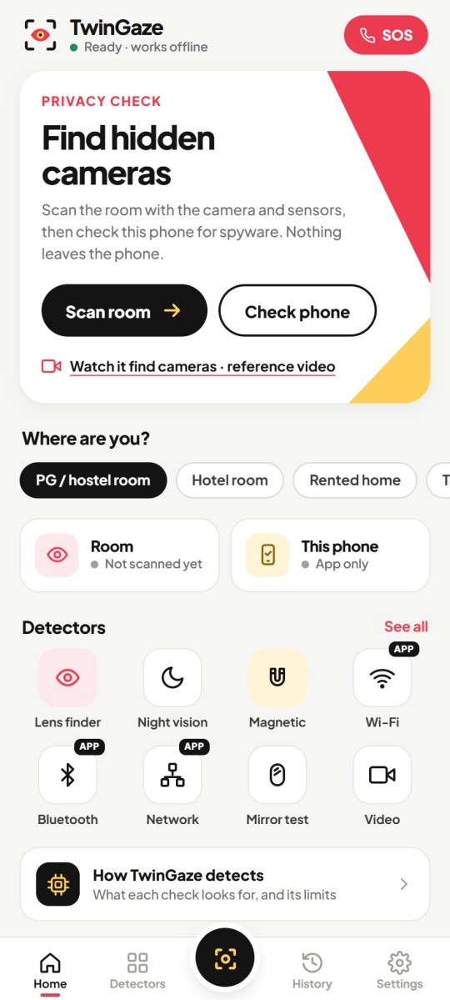<br><b>Home</b></td>
<td align="center" width="25%">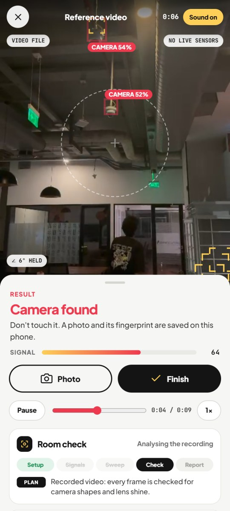<br><b>Scan</b>: both CCTV domes boxed</td>
<td align="center" width="25%">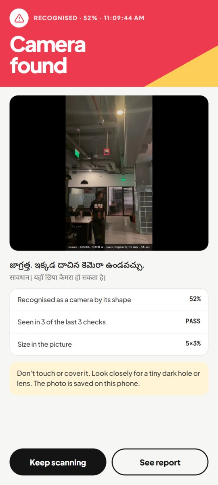<br><b>Camera found</b></td>
<td align="center" width="25%">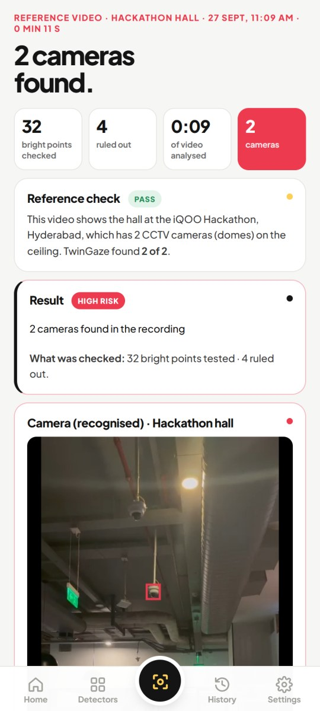<br><b>Report</b></td>
</tr>
<tr>
<td align="center">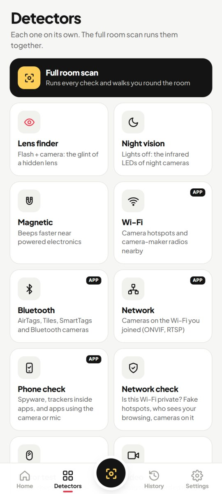<br><b>Detectors</b></td>
<td align="center">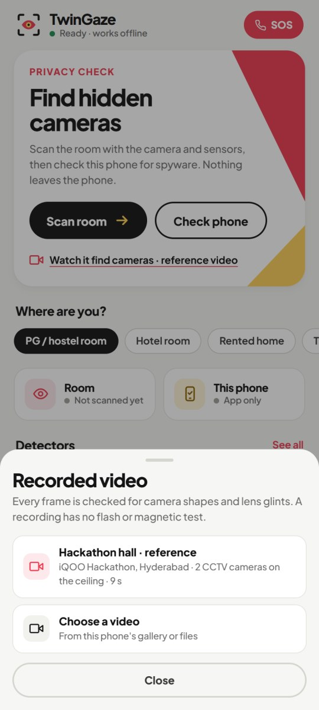<br><b>Recorded video</b></td>
<td align="center">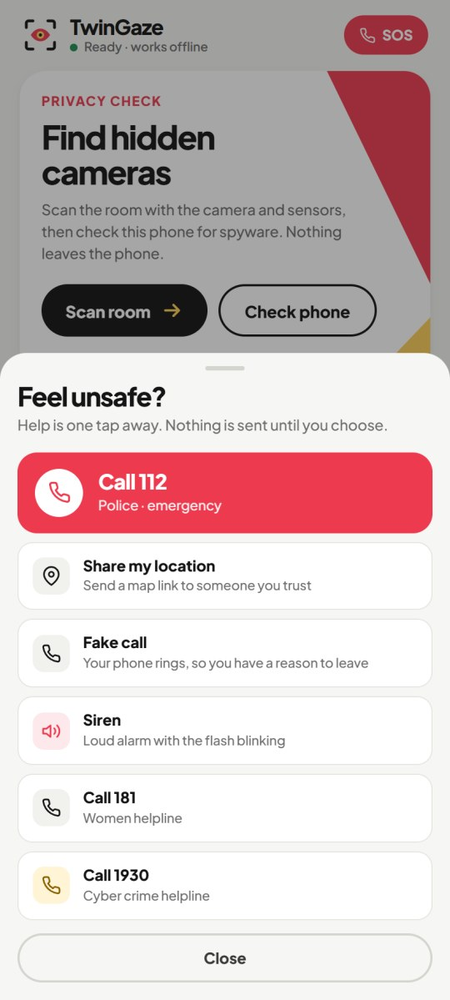<br><b>SOS</b></td>
<td align="center">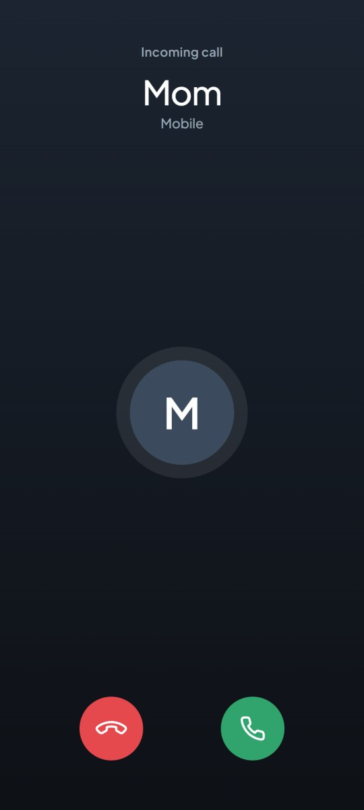<br><b>Fake call</b></td>
</tr>
<tr>
<td align="center">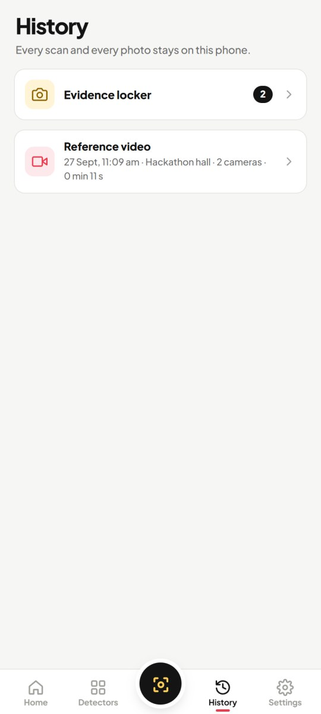<br><b>History</b></td>
<td align="center">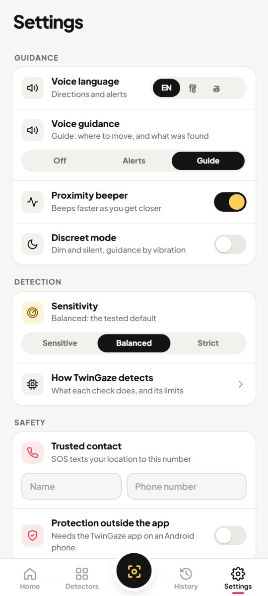<br><b>Settings</b></td>
<td align="center">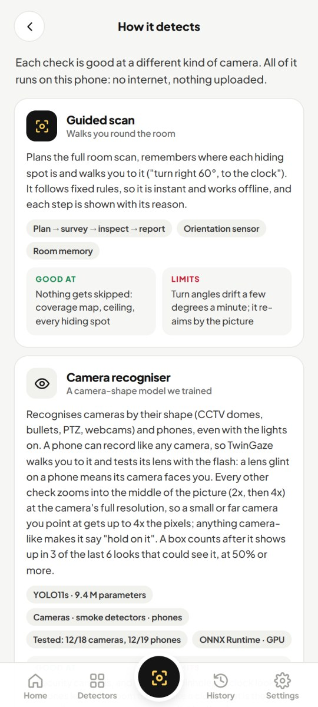<br><b>How it detects</b></td>
<td></td>
</tr>
</table>

---

## How to use it, tab by tab

The bar at the bottom has four tabs and a round scan button in the middle.

### Home
- **SOS** (top right): opens the safety sheet. Call 112, share your location, fake call, siren, 181, 1930.
- **Find hidden cameras**:
  - **Scan room** starts the full room scan.
  - **Check phone** checks this phone for spyware.
  - **Watch it find cameras · reference video** plays the built-in video of the hackathon hall. TwinGaze analyses it live and should find its 2 CCTV cameras.
- **Where are you?** PG / hostel room, Hotel room, Rented home, Trial room or Washroom. This sets the checklist of hiding spots and the address in the complaint.
- **Room / This phone**: the result of your last room scan and phone check.
- **Detectors**: shortcuts to each check. **See all** opens the Detectors tab.
- **How TwinGaze detects**: what each check looks for, and its limits.

### The round scan button (middle): full room scan
Starts the guided scan. The **Room check** card shows its steps:

1. **Setup**: it reads the light, the flash and the sensors, and picks a strategy (lit room: go close; dark room: lens shine shows from across the room).
2. **Signals**: Wi-Fi, Bluetooth and the local network are scanned in the background.
3. **Sweep**: you turn slowly all the way round and look up at the ceiling. A small radar shows where you have looked, and every hiding spot it sees (clock, frame, smoke detector, socket…) is remembered with its direction.
4. **Check**: it walks you to each spot: "Turn right 60°, to the clock", "Move left", "Hold the flash on it for 3 seconds".
5. **Report**: the result and the evidence.

On the scan screen:
- a **red box** is a camera;
- **yellow brackets** are a bright spot being tested, and the one being tested says **CHECKING**;
- **dashed boxes** are room objects (yellow is a hiding spot, green is checked, blue is a person).

The bottom panel shows the current instruction, a signal meter, **Photo** and **Finish**. Anything it finds shows a **Camera found** alert and vibrates, with a chime and the voice.

### Detectors
Every check on its own: Full room scan, Lens finder, Night vision, Magnetic, Wi-Fi, Bluetooth, Network, Phone check, Network check, Mirror test, Video and SOS. Checks marked **APP** need the Android app (a web browser cannot scan radios or other apps).

### History
Every scan, phone check and network check, newest first; tap one to open its report. **Evidence locker** holds every saved photo with its fingerprint. Everything stays on the phone.

### Settings
- **Guidance**
  - Voice language: English, हिंदी, తెలుగు.
  - Voice guidance: Off, Alerts or Guide.
  - Voice: pick one of the phone's offline voices.
  - Proximity beeper.
  - Discreet mode.
- **Detection**: Sensitivity, and How TwinGaze detects.
- **Safety**
  - Trusted contact.
  - **Protection outside the app**: the switch for power-button SOS, shake SOS, the Quick Settings tile and privacy alerts while TwinGaze is closed, with buttons to allow notifications, SMS and running in the background.

---

## How it works

### A bright spot has to earn "Camera found"

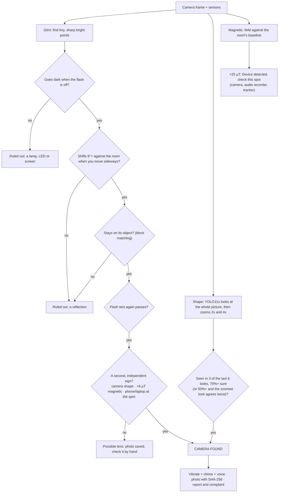

- **A glint alone is never enough.** A tiny shiny bead or screw head can pass the light tests, so without a second sign it stays a "possible lens".
- **Small, far cameras.** The shape model takes turns looking at the whole picture, the middle half (2x) and the middle quarter (4x) of the full-resolution frame, so a CCTV dome across a hall gets 2 to 4 times the pixels.
- **Two cameras close together stay two.** A camera found again after you step aside is recognised as the same one (within 18°). If the earlier one is on screen at the same time, somewhere else, the two are counted as two.

### The guided scan
The full room scan runs as a plan: **Setup → Signals → Sweep → Check → Report**. Its parts share one memory of the room: light and sensors, radio, coverage (12 × 30° plus the ceiling), hiding spots with their directions, bright spots still to test, and magnetic jumps. A bright spot or a camera in view always takes over; once it is done, the plan carries on, so a second camera is not missed. It is fixed rules, not a chatbot: instant, predictable and offline.

### The voice
One sentence at a time, with four levels: an urgent find cuts in after a chime; results wait for the current sentence; directions are only spoken once they stop changing; tips wait for four seconds of quiet. Each step is explained fully once per scan, then in a word.

---

## AI models

Both models run **on the phone** with ONNX Runtime (on the GPU through WebGPU, else on the CPU), in a background worker so the camera never freezes.

| | Camera detector | Room objects |
|---|---|---|
| Model | **YOLO11s**, trained for TwinGaze | YOLOv8n, Open Images V7 (pre-trained) |
| Size | 9.4 M parameters · 36 MB · 416×416 | 13.5 MB · 416×416 |
| Classes | camera · smoke detector · phone | 49 room objects (clock, frame, mirror, socket, lamp, fan, person…) |
| Used for | "Camera found" by shape; phones as hidden cameras | Hiding-spot hints, the room checklist, a phone or laptop at a glint |

**How the camera detector was made:**
1. **Photos:** about 1,100 freely licensed Wikimedia Commons photos of CCTV and security cameras, rooms, ceilings and around 170 smoke detectors. Plus 306 phone photos, 238 look-alikes (remotes, power banks, calculators…), and real false alarms from the hackathon hall as hard negatives.
2. **Labels:** Google OWLv2 and Grounding DINO labelled every photo automatically, and a box was kept only when both agreed.
3. **Training:** 100 epochs with PyTorch and Ultralytics on an NVIDIA RTX 5050 laptop GPU.

| Held-out photos (never seen in training) | Cameras found (of 18) | False alarms (33 camera-free) |
|---|---|---|
| Off-the-shelf zero-shot detectors | 4 | 5 |
| YOLO11n (2.6 M), our first model | 12 | 2 |
| **YOLO11s (9.4 M), in the app** | **12** | **0** |

On the built-in video of the hackathon hall, TwinGaze finds **both CCTV domes within about 2 seconds, in 5 of 5 runs**, with no false cameras.

TwinGaze uses **no LLM and no cloud AI**.

---

## Architecture and tech stack

```mermaid
flowchart LR
    subgraph HW["Phone hardware"]
      CAM["Camera + flash"]
      SEN["Magnetometer · gyroscope · accelerometer · light"]
      RAD["Wi-Fi · Bluetooth LE · GPS"]
      PWR["Power button · camera/mic service"]
    end
    subgraph AND["Android layer (Java)"]
      CAP["Capacitor 8 bridge"]
      NAT["TwinNative: sensors, voice, torch, gallery"]
      RDO["TwinRadio: Wi-Fi, Bluetooth, LAN scans"]
      GRD["TwinGuard: apps, permissions, trackers"]
      PRT["TwinProtect + service: SOS, fake call, alerts"]
    end
    subgraph CORE["TwinGaze core (JavaScript)"]
      DET["detector.js: glint detection + tracking"]
      REC["recognizer.js + worker: ONNX Runtime, YOLO11s + YOLOv8n"]
      AGT["agent.js: guided scan"]
      APP["app.js: scan loop, scoring, UI, report"]
      VOC["voice.js · safety.js · radio / net / guard"]
    end
    subgraph OUT["On the phone"]
      UI["Boxes, arrows, radar"]
      VO["Voice EN / HI / TE"]
      EV["Photos + SHA-256 (IndexedDB)"]
      RP["Report + complaint"]
    end
    HW --> AND --> CORE --> OUT
```

| Layer | Technology |
|---|---|
| App | HTML5, CSS, JavaScript (no framework; ~7,100 lines). The same code is the Android app and the website (an offline PWA) |
| Android | Capacitor 8, Java (~3,500 lines): 4 plugins, a foreground service, a Quick Settings tile, a boot receiver. Android 7 to 16 (SDK 24 to 36) |
| On-device AI | ONNX Runtime Web 1.30, WebGPU (GPU) or WebAssembly SIMD (CPU), in a Web Worker |
| Model training | Python, PyTorch, Ultralytics YOLO11; auto-labelling with OWLv2 and Grounding DINO |
| Storage and integrity | IndexedDB and localStorage (on the phone only), SHA-256 via Web Crypto |
| Voice and sound | Android text-to-speech (offline Indian voices), Web Audio |
| Phone to laptop | vivo Office Kit: report through the share sheet, album sync, shared clipboard, screen mirroring |

There is **no server**: the phone is the backend. The only things that leave it are what you choose to send (the SOS SMS, a shared report).

---

## Install the app

1. Download **[TwinGaze.apk](https://github.com/SOURABREDDY394/twingaze/raw/main/dist/TwinGaze.apk)** (57 MB) on your Android phone.
2. Open it. If asked, allow **Install unknown apps** for your browser or file manager.
3. Open TwinGaze. It asks for each permission only when a feature needs it (camera for a scan, location for Wi-Fi scans and SOS, SMS for SOS, and so on).

Over USB from a computer: `adb install -r dist/TwinGaze.apk`. On Xiaomi / Redmi / POCO, first turn on **Settings → Additional settings → Developer options → Install via USB**.

For protection outside the app to keep working on Xiaomi, vivo or OPPO phones, tap **Keep it running** and then **Allow Autostart** in Settings.

---

## Build from source

Needs Node.js 22+, JDK 21 and the Android SDK (platform 36).

```bash
# web app → android-app/www, and the website → site/
node tools/build-web.mjs
node tools/build-web.mjs site

# Android app
cd android-app
npm install
npx cap sync android
cd android
./gradlew assembleDebug        # JAVA_HOME = a JDK 21
# → android-app/android/app/build/outputs/apk/debug/app-debug.apk
```

Run the tests (83 in all):

```bash
node tests/detector.test.js
node tests/agent.test.js
node tests/voice.test.js
node tests/radio.test.js
node tests/guard.test.js
node tests/privacy.test.js
```

To try the website locally, serve the project folder over https (the camera needs a secure page): `node tools/serve.mjs`.

---

## Project structure

```
index.html, css/app.css     screens and design (same in the app and on the website)
js/
  app.js                    screens, scan loop, scoring, guidance, evidence, report, SOS
  detector.js               bright-spot (glint) detection and tracking
  recognizer.js             the two on-phone models (ONNX Runtime Web)
  infer-worker.js           runs the models off the main thread
  agent.js                  the guided room scan
  voice.js, audio.js        voice (English / Hindi / Telugu) and the beeper
  sensors.js, native.js     camera, flash, sensors; bridge to Android
  radio.js, net.js          Wi-Fi / Bluetooth / network checks
  guard.js, trackers.js,
  spyware-db.js             phone check: stalkerware list and tracker SDKs
  safety.js                 SOS, fake call, siren, trusted contacts
models/                     camera-detector.onnx (trained for TwinGaze), objects.onnx
media/hall-reference.mp4    the built-in reference video (hackathon hall, 2 CCTV cameras)
vendor/                     ONNX Runtime Web, bundled fonts
android-app/                the Android project (Capacitor); Java in
                            android/app/src/main/java/in/teamragnarok/twingaze/
tests/                      83 automated tests
tools/                      build and serve scripts
dist/TwinGaze.apk           the ready-to-install app
docs/screenshots/           the pictures in this README
presentation/               pitch script (PDF) and a list of every module
README.txt                  detailed technical notes and the change history
```

---

## Privacy

- Everything runs on the phone: the camera, both AI models, the voice and the storage.
- No account and no server. Nothing is uploaded.
- Photos, history and settings stay in the app on the phone. You can save a photo to the gallery or delete it.
- The app only reads the network to find devices on your own Wi-Fi. It sends no test traffic anywhere.
- Nothing is sent without you: the SOS SMS goes only to the trusted contact you added, and the complaint opens in your own app for you to send.

---

## Limits

- It can miss a camera that is covered, pointed away, or behind tinted plastic. "No camera found" lowers the risk; it does not rule one out.
- A pinhole camera inside a clock looks like a clock to the shape model. The flash and magnetic checks are what find it.
- A CCTV dome far across a big hall is at the edge of the shape model: walk closer and point at it.
- The magnetic check reacts to any powered device up close. It cannot tell a camera from a recorder or a charger, so it asks you to check the spot.
- Smoke detectors are sometimes confused with dome cameras.
- Radio scans need the Android app, and many cameras record to a memory card with no Wi-Fi at all.

---

## Team and credits

**Team Ragnarok** · iQOO Hackathon 2026, Hyderabad
Anshul Nautiyal (team lead) · Prathibha Rani Patra · Sourab Reddy

Built with:
- [ONNX Runtime Web](https://onnxruntime.ai/) (MIT)
- [Capacitor](https://capacitorjs.com/) (MIT)
- [Ultralytics YOLO](https://github.com/ultralytics/ultralytics) (AGPL-3.0)
- Training photos from [Wikimedia Commons](https://commons.wikimedia.org/), under free licences
- Labels made with Google OWLv2 and Grounding DINO (Apache-2.0)
- [Stalkerware Indicators of Compromise](https://github.com/AssoEchap/stalkerware-indicators) by Echap (CC BY 4.0)
- Fonts: Plus Jakarta Sans, JetBrains Mono and Noto Sans (SIL OFL 1.1)

Research TwinGaze builds on:
- **LAPD:** Hidden Spy Camera Detection using Smartphone Time-of-Flight Sensors (NUS, ACM SenSys 2021)
- **Lumos:** Identifying and Localizing Diverse Hidden IoT Devices in an Unfamiliar Environment (CMU, USENIX Security 2022)

The pitch script with architecture diagrams and flow charts is in [`presentation/TwinGaze-Pitch.pdf`](presentation/TwinGaze-Pitch.pdf). Detailed technical notes and the change history are in [`README.txt`](README.txt).
